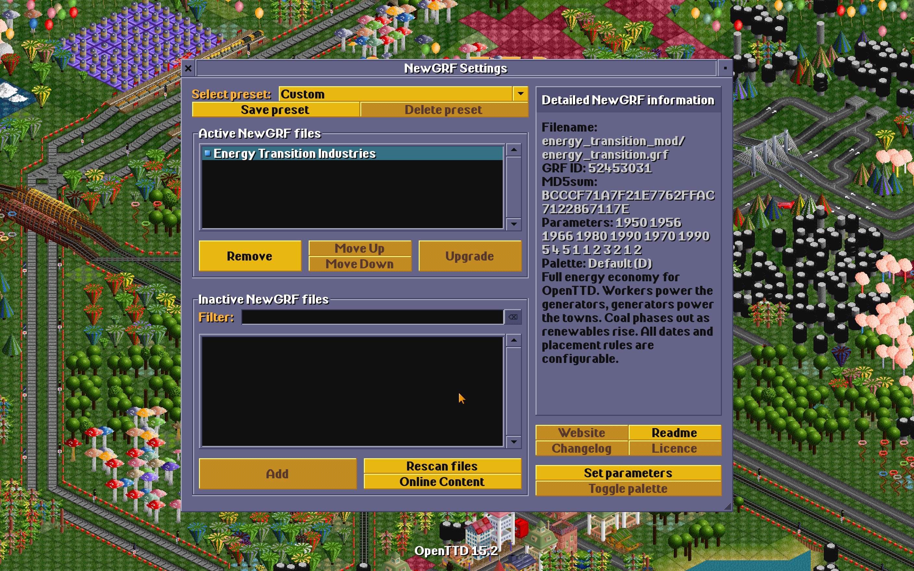

[OpenTTD](https://www.openttd.org) is a game I've come back to over and over again (for decades!). There's something deeply satisfying about its pace, the logic, building things, watching the towns grow, optimising travel routes for efficiency - I love it!

Something that's always nothered me though, is how as the game clock ticks through the decades and the world changes with it but the energy economy remains entirely static. The coal mine feeds the coal power station, the coal power station sits there forever, and meanwhile the game transitions from Steam trains to Maglevs ([Robert Llewellyn](https://bsky.app/profile/did:plc:icpcewckffb4arhmydvyovun) would be properly upset too).

This bothered me so much that I decided to dust off a Claude chat session and build something to make this right. Now this is absolutely not finished.., in fact the gaping chasm is the graphics... a pixel artist I am not so youll find some pretty ropey efforts from Claude in there. But it works! Maybe at some point I can find someone generous enough to contribute some wonderful in game artwork.

**[Energy Transition Industries](https://github.com/nathanpitman/Open-TTD-Renewable-Energy-Mod)** is a NewGRF + Game Script combo that wires a proper energy economy into the game. New industries appear across the timeline — Hydroelectric Dams from 1950, Nuclear Power Plants from 1956, Tidal Stations in 1966, Wind Farms in 1980, Solar Farms from 1990. Coal plants stop spawning around 1970 and start closing out by 1990. The dates are all configurable if you want a different pace.

The bit I'm most pleased with is the invisible power grid. A Game Script runs every 30 days, scans towns for nearby generators, and sets growth rates based on how much power is available. No power? Town stops growing. Full power plus a nearby substation? It hums along nicely. It makes energy feel like something that actually matters, rather than just another cargo chain to ignore.

There's also a worker mechanic — generators need a steady supply of passengers to run at full output. It ties your transport network into your energy infrastructure in a way that feels natural.

I built this for myself but it's on GitHub if you fancy giving it a shot, feedback appreciated. 

[github.com/nathanpitman/Open-TTD-Renewable-Energy-Mod](https://github.com/nathanpitman/Open-TTD-Renewable-Energy-Mod)
